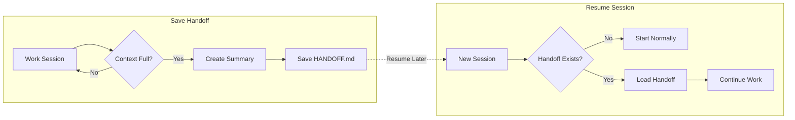

# Session Handoff

Never lose your place when a Claude Code session hits its context limit. This
plugin automatically captures everything you were working on into a session
handoff the moment context fills up, then automatically loads it back into your
next session so you can resume instantly — no re-explaining from scratch.

It is **fully generic**: it auto-detects the kind of work from the conversation, so
it works the same for development, sales, marketing, SEO, accounting, HR, legal,
research, support, content, or planning teams.

> **Built for teams.** The handoff is written to a **git-ignored**
> `.session-handoff/` directory (never committed), the loader is **cross-platform**
> (pure Python — no bash dependency), secrets are **redacted** before anything is
> sent to the API or written to disk, and a **local-only** mode keeps the
> transcript on your machine. Every run is logged for debuggability.

## What It Does

1. **When context nears the limit** — the `PreCompact` hook fires, reads the
   session transcript (including a compact trace of file edits and commands), and
   uses the Anthropic API to write a structured handoff to
   `.session-handoff/HANDOFF.md` (work type, what's done, current status, pending
   items, key context, activity trace, blockers, and a ready-to-paste resume
   prompt). A timestamped copy is also kept under `.session-handoff/history/`.
2. **At the start of a new session** — the `SessionStart` hook detects the handoff
   and injects it back into context. If it is older than the staleness threshold
   (24h by default), it is flagged as *possibly stale* rather than presented as the
   live task.
3. **On demand** — the bundled skill lets you say "save my progress" or "create a
   handoff" any time, without waiting for the limit.

## How It Works (at a glance)

The plugin has two halves: it **saves** a handoff when context fills up, and
**resumes** from it when you start the next session.




> GitHub renders this diagram automatically. If you are viewing the raw Markdown,
> paste the block into the [Mermaid Live Editor](https://mermaid.live) to see it.

## Components

| Component | Purpose |
|-----------|---------|
| `PreCompact` hook (`auto_handoff.py`) | Generates the handoff when context nears the limit |
| `SessionStart` hook (`load_handoff.py`) | Loads the handoff into the next session, with a staleness check |
| `handoff_lib.py` | Shared config, section schema, secret redaction, and logging (single source of truth) |
| `session-handoff` skill | Guides handoff creation, what-to-preserve rules, and resume behavior |

## What Gets Written (and where)

```
<your project>/
  .session-handoff/            # git-ignored automatically
    HANDOFF.md                 # the latest handoff (loaded on next session)
    history/HANDOFF-<stamp>.md  # immutable, timestamped history
    handoff.log                # rotating debug log
```

## How to Use in Claude Code (CLI / Terminal)

1. **Install the plugin** by cloning it into your Claude Code plugins folder:

   ```bash
   git clone https://github.com/mDprajapati/session-handoff.git \
     ~/.claude/plugins/session-handoff
   ```

   On Windows (PowerShell), the target is `$env:USERPROFILE\.claude\plugins\session-handoff`.

2. **Restart Claude Code** so it loads the new hooks and skill:

   ```bash
   claude
   ```

3. **Verify it's active** — run the `/plugin` command inside Claude Code and confirm
   `session-handoff` appears in the list of installed plugins.

4. **Use it:**
   - *Automatic* — just work normally. When context nears its limit, the `PreCompact`
     hook writes `HANDOFF.md` to your project folder, and the `SessionStart` hook loads
     it back the next time you open Claude Code in that directory.
   - *On demand* — type the `/session-handoff` skill, or ask Claude to
     "create a handoff" / "save my progress" at any time.

## How to Use in the Claude Code Desktop App

The desktop app (macOS / Windows) shares the same plugin system as the CLI, so the
plugin works identically once installed.

1. **Install the plugin** using either method:
   - *Via the app* — open the command bar and run `/plugin`, then add and install the
     plugin from its repository.
   - *Manually* — clone the repo into the plugins folder (same path as the CLI):

     ```bash
     git clone https://github.com/mDprajapati/session-handoff.git \
       ~/.claude/plugins/session-handoff
     ```

     On Windows: `%USERPROFILE%\.claude\plugins\session-handoff`.

2. **Set your Anthropic API key** (see [Setup](#setup) below) in the environment the
   desktop app inherits, so the AI-generated summary works. Without it, the plugin
   still falls back to capturing the last messages of the session.

3. **Quit and reopen the desktop app** so the hooks and skill are loaded.

4. **Use it** exactly as in the CLI — automatic handoff on compaction, or run the
   `/session-handoff` skill from the in-app command bar to create one on demand.

> **Note:** This plugin relies on Claude Code's `PreCompact` and `SessionStart` hooks.
> It targets Claude Code (both the CLI and the desktop app). It is not designed for the
> separate Claude chat apps (claude.ai / Claude for Desktop chat), which do not run
> Claude Code hooks.

## Setup

For the AI-generated summary, set your Anthropic API key in the environment:

```bash
export ANTHROPIC_API_KEY="sk-ant-..."
```

**If no key is present, the plugin still works** — it falls back to extracting the last
messages of the session directly (including the last concrete request as the resume
line), so you never lose your handoff entirely.

No other configuration is required. After installing, restart Claude Code so the
hooks activate.

## Usage

- **Automatic:** Just work normally. When context fills up, the handoff appears at
  `.session-handoff/HANDOFF.md` and is loaded for you next time.
- **Manual:** Ask Claude to "create a handoff" or "save my progress" at any point.
- **Test it:** Run `/compact` inside Claude Code, then check
  `.session-handoff/HANDOFF.md`.

## Notes

- The handoff is written under `.session-handoff/` in the current project directory
  (`CLAUDE_PROJECT_DIR`), which is added to `.gitignore` automatically so it is
  never committed.
- Delete `.session-handoff/HANDOFF.md` after you've resumed, or it will load again
  next session. History under `.session-handoff/history/` is pruned automatically.
- Failures are recorded in `.session-handoff/handoff.log` — check there first if a
  handoff didn't generate.
- The exact trigger point is whenever Claude Code decides to compact (typically
  80–95% context); `PreCompact` is the closest built-in hook to a strict "90%".

## Development

Requires Python 3.7+ (standard library only — no dependencies).

```bash
pip install pytest        # only needed to run the test suite
pytest                    # run the tests in tests/
```

CI (GitHub Actions, `.github/workflows/ci.yml`) runs the tests, byte-compiles the
hooks, and validates the JSON manifests on every push and pull request.
