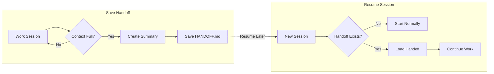

# Session Handoff

Never lose your place when a Claude Code session hits its context limit. This
plugin automatically captures everything you were working on into a session
handoff the moment context fills up, then automatically loads it back into your
next session so you can resume instantly — no re-explaining from scratch.

It is **fully generic**: it auto-detects the kind of work from the conversation, so
it works the same for development, sales, marketing, SEO, accounting, HR, legal,
research, support, content, or planning teams.

> **Built for teams.** The handoff is written to a **git-ignored**
> `.session-handoff/` directory (never committed), the loader is **cross-platform**
> (pure Python — no bash dependency), secrets are **redacted** before anything is
> sent to the API or written to disk, and a **local-only** mode keeps the
> transcript on your machine. Every run is logged for debuggability.

## What It Does

1. **When context nears the limit** — the `PreCompact` hook fires, reads the
   session transcript (including a compact trace of file edits and commands), and
   uses the Anthropic API to write a structured handoff to
   `.session-handoff/HANDOFF.md` (work type, what's done, current status, pending
   items, key context, activity trace, blockers, and a ready-to-paste resume
   prompt). A timestamped copy is also kept under `.session-handoff/history/`.
2. **At the start of a new session** — the `SessionStart` hook detects the handoff
   and injects it back into context. If it is older than the staleness threshold
   (24h by default), it is flagged as *possibly stale* rather than presented as the
   live task.
3. **On demand** — the bundled skill lets you say "save my progress" or "create a
   handoff" any time, without waiting for the limit.

## How It Works (at a glance)

The plugin has two halves: it **saves** a handoff when context fills up, and
**resumes** from it when you start the next session.




> GitHub renders this diagram automatically. If you are viewing the raw Markdown,
> paste the block into the [Mermaid Live Editor](https://mermaid.live) to see it.

## Where It Works

This plugin runs on Claude Code's `PreCompact` and `SessionStart` hooks, so it works
**only inside Claude Code** — not in every product that happens to use a Claude
account.

| Surface | Works? | Notes |
|---------|:------:|-------|
| Claude Code **CLI / terminal** | ✅ | Native |
| Claude Code **Desktop app** | ✅ | Same Claude Code engine |
| **VS Code** — *Claude Code extension* | ✅ | Bundles Claude Code |
| **JetBrains** — Claude Code plugin | ✅ | Uses the CLI |
| **claude.ai (web)** | ❌ | Cloud sandbox; does not run local hooks/plugins |
| **Cursor** (even with a Claude account) | ❌ | Separate product, not Claude Code |

> Plugin installs are **local to each Claude Code installation** — they are not synced
> across devices by your Claude account. Each teammate installs once (or uses the
> project auto-install below).

## Install

The commands below work the same in any supported Claude Code surface (CLI, Desktop,
VS Code, or JetBrains).

### Option A — Marketplace install (per person)

Run these two commands inside Claude Code:

```text
/plugin marketplace add mDprajapati/session-handoff
/plugin install session-handoff@session-handoff
```

Then verify with `/plugin` — `session-handoff` should appear in the installed list.

### Option B — Team auto-install (zero commands)

Commit a `.claude/settings.json` into the repo your team works in (this plugin repo
already ships one as a template):

```json
{
  "extraKnownMarketplaces": {
    "session-handoff": {
      "source": { "source": "github", "repo": "mDprajapati/session-handoff" }
    }
  },
  "enabledPlugins": {
    "session-handoff@session-handoff": true
  }
}
```

When a teammate opens that repo in Claude Code and trusts the folder, Claude Code
prompts them to add the marketplace and enable the plugin automatically — no commands
to remember.

## Setup

For the AI-generated summary, set your Anthropic API key in the environment:

```bash
export ANTHROPIC_API_KEY="sk-ant-..."
```

**If no key is present, the plugin still works** — it falls back to extracting the last
messages of the session directly (including the last concrete request as the resume
line), so you never lose your handoff entirely.

No other configuration is required. After installing, restart Claude Code so the
hooks activate.

## Usage

- **Automatic:** Just work normally. When context fills up, the handoff appears at
  `.session-handoff/HANDOFF.md` and is loaded for you next time.
- **Manual:** Ask Claude to "create a handoff" or "save my progress" at any point.
- **Test it:** Run `/compact` inside Claude Code, then check
  `.session-handoff/HANDOFF.md`.

## Commands & Phrases Cheat Sheet

Everything you can type. There are no custom slash commands to memorize — saving and
resuming are driven by plain English, so it works the same for any kind of work.

| You type… | When | What happens |
|-----------|------|--------------|
| *(nothing — just keep working)* | Any session | Handoff **auto-saves** when context fills up and **auto-loads** at the start of your next session |
| `save my progress` *(or)* `create a handoff` | Any time mid-session | Writes `.session-handoff/HANDOFF.md` right now, without waiting for the limit |
| `summarize what we did so we can continue later` | Wrapping up for the day | Same as above — a manual handoff |
| `what was I working on?` | Start of a new session | Claude reads the loaded handoff and tells you your open task + next step |
| `/compact` | A session that has real history | Manually triggers compaction, which fires the save hook (the easiest way to test it) |
| `/plugin marketplace add mDprajapati/session-handoff` | One-time setup | Adds the marketplace |
| `/plugin install session-handoff@session-handoff` | One-time setup | Installs the plugin |

> Tip: after you've resumed and finished the handed-off work, delete
> `.session-handoff/HANDOFF.md` so it doesn't load again next session.

## Real-World Use Cases

The plugin auto-detects the kind of work from your conversation, so the same two
habits — *"save my progress"* and *"what was I working on?"* — cover every team.

### 1. Developer — a long debugging session

You're three hours into tracing a flaky test and Claude warns context is filling up.
You don't stop to write notes — the `PreCompact` hook captures the files you edited,
commands you ran, and the root cause you'd narrowed down. Tomorrow you open the repo
and type **`what was I working on?`**; Claude replays the failing test, the fix you
were about to try, and the exact next step.

```text
what was I working on?
```

### 2. Sales — a multi-touch deal across several sessions

You're drafting a proposal for a prospect and gathering pricing approvals over two
days. Before logging off you type **`save my progress`**. The handoff records the
client name, deal size, the discount you're waiting to get signed off, and the next
action ("send revised quote once Finance approves 12%"). Next session you pick up
without re-reading the whole email thread.

```text
save my progress
```

### 3. Marketing / SEO — an on-page audit in progress

Halfway through auditing 40 URLs you need to leave for a meeting. You ask Claude to
**`create a handoff`**; it logs which URLs are done, the title-tag pattern you
decided on, and the 18 pages still pending. When you return, **`what was I working
on?`** hands you the remaining list in priority order.

### 4. Accounting / Finance — month-end close

You're reconciling accounts and the session is getting long. The handoff preserves
the ledgers already balanced, the two variances still under investigation, and the
deadline. A teammate in another timezone can open the same project and resume from
your handoff — no verbal status update needed.

### 5. HR / Recruiting — a hiring round

You're comparing candidates and drafting feedback. **`save my progress`** captures
who's been screened, the scorecard decisions made and *why*, and who's next to
interview. The "Important Context" section keeps names and decisions straight so the
next session doesn't mix candidates up.

### 6. Research / Legal — a multi-source review

You're synthesizing findings across documents and the context limit is near. The
handoff keeps the sources already reviewed, the argument you're building, and the
open questions still to verify — so a deep review survives across sessions instead of
collapsing into a vague summary.

### 7. Async team relay — hand work to a teammate

Because the handoff is a plain `.session-handoff/HANDOFF.md` file, one person can do
the morning's work, then a colleague opens the **same project** in Claude Code and
the `SessionStart` hook loads the handoff for them automatically. They type
**`what was I working on?`** and continue where the first person stopped.

> `.session-handoff/` is git-ignored, so it won't sync through version control. For a
> true async relay, share the project folder (shared drive, synced directory) or paste
> the **Resume Prompt** from the handoff into the teammate's session.

## Notes

- The handoff is written under `.session-handoff/` in the current project directory
  (`CLAUDE_PROJECT_DIR`), which is added to `.gitignore` automatically so it is
  never committed.
- Delete `.session-handoff/HANDOFF.md` after you've resumed, or it will load again
  next session. History under `.session-handoff/history/` is pruned automatically.
- Failures are recorded in `.session-handoff/handoff.log` — check there first if a
  handoff didn't generate.
- The exact trigger point is whenever Claude Code decides to compact (typically
  80–95% context); `PreCompact` is the closest built-in hook to a strict "90%".

## Development

Requires Python 3.7+ (standard library only — no dependencies).

```bash
pip install pytest        # only needed to run the test suite
pytest                    # run the tests in tests/
```

CI (GitHub Actions, `.github/workflows/ci.yml`) runs the tests, byte-compiles the
hooks, and validates the JSON manifests on every push and pull request.
